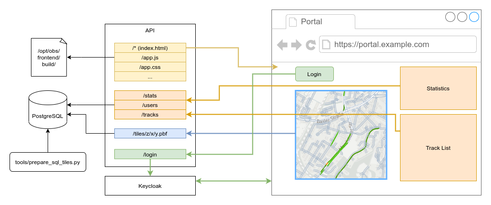

# Portal Architecture

Here I try to describe how the portal works in general, and which parts are
needed and developed in this repository. There is some variation possible for a
full setup, for example the data flow of the rendered data tiles can be
different.  This article describes the standard production setup. 

## General overview of the components

* **api**: A python process using Sanic to provide a HTTP interface. Everything
  revolves around this.
* **postgresql**: A database instance.
* **frontend**: A React based web application.
* **worker**: Optional, a dedicated process for processing of tracks
* **keycloak**: An installation of [Keycloak](https://www.keycloak.org/) which
  stores user credentials and provides a secure login, registration, password
  recovery, and more.
* **tools**: Scripts to run as an operator of the application for various setup
  and maintenance task.



## PostgreSQL

This is a database instance running the modified postgresql docker image
`openmaptiles/postgis:6.0`. This includes the extensions `postgis` and
`hstore`, among others, used for geospatial data processing.

You can try to use an external postgresql installation instead of the docker 
image, however, a lot of prequisites have to be installed into that database.

You can check out how the docker image is generated in [its
repository](https://github.com/openmaptiles/openmaptiles-tools/tree/master/docker/postgis)
and try to replicate that setup. However, this is generally not supported by
the developers of the OpenBikeSensor portal.

## API

The API is written in Python 3 with [Sanic](https://sanicframework.org/) for
HTTP handling. It supports Python 3.6+ and comes with a list of dependencies
that is required. One of those is `openmaptiles-tools`, which is installed from
git (see `api/requirements.txt`).

The API has the following tasks:

* Handle user authentication through keycloak 
* Receive track uploads and serve track data and statistics via a RESTful API
* Process received tracks (unless using a dedicated worker, see below)
* Publish vector tiles directly from the database (if installed and configured)

### Authentication

The frontend can redirect to `$API_URL/login` to trigger a login. The API
negotiates a session and redirects the user agent to the keycloak instance.
Upon successful authentication, it receives user data and generates a user
object (or discovers the existing one) for the authenticated keycloak user.

A session is instanciated and kept alive through a session cookie. The API
currently stores session data in memory, so scaling the API process to more
replicas is not yet unsupported.

### RESTful API

There is not a lot to talk about here. The routes are pretty self explanatory,
please refer to the code for the current API. Consider it unstable as of now.

There are routes for general info (version number), track and recording
statistics (by user and time range), user management and track management.

### Track processing

If a dedicated worker is not used, the API runs the same logic as the worker
(see below), in an asyncio "background" task. It is however *not* threaded, so
it may block API request while processing tracks. This is the reason why a
dedicated worker is recommended, though for a simple or low traffic setup, it
is definitely not required. Configure whether you're using a dedicated worker
through the `DEDICATED_WORKER` api config flag.

### Publish vector tiles

Thanks to the [OpenMapTiles](https://openmaptiles.org/) project, we're able to
generate vector tiles from live data, directly in the PostGIS database. The
general workflow is as follows:

* We have defined a schema compatible with the `openmaptiles-tools` collection
  that defines how to collect geospatial data from the postgresql database.
  This depends on its `postgis` extension for computing geospatial information
  (e.g. intersecting with a bounding box). This schema consists of a number of
  layers, which contain SQL code that is used to produce the layer's geometries
  and their attached properties.
* The `tools/prepare_sql_tiles.py` tool calls the respective scripts from
  `openmaptiles-tools`, to compile all required SQL code into functions,
  generate the "destination" function `getmvt` for generating a vector tile,
  and store these [User-Defined
  Functions](https://www.postgresql.org/docs/current/xfunc.html) in the
  database.
* When a tile is requested from the Map Renderer through
  `/tiles/{z}/{x}/{y}.pbf`, the API calls `getmvt` to have postgresql generate
  the tile's content on the fly, and serves the result through HTTP.

For all of this to work, the `openmaptiles-tools` must be installed, and the
database has to prepared with the functions once, by use of the
`api/tools/prepare_sql_tiles.py` script. That script should be rerun every time the
schema changes, but doesn't need to be used if the data in the database was
edited, e.g. by uploading and processing a new track.

## Frontend

The frontend is written in React, using Semantic UI
([semantic-ui-react](https://react.semantic-ui.com/) and
[semantic-ui-less](https://www.npmjs.com/package/semantic-ui-less)), compiled
with Webpack. In a simple production setup, the frontend is compiled statically
and served by the API.

The `openbikesensor-portal` image (`Dockerfile` in repo root) performs the
build step and stores the compiled bundle and assets in
`/opt/obs/frontend/build`. The API process can simply serve the files from there.

This is done with a catchall route in `obs.api.routes.frontend`, which
determines whether to serve the `index.html` or an asset file. This ensures
that deep URLs in the frontend receive the index file, as frontend routing is
done in the JavaScript code by `react-router`.

In a development setup the frontend is served by a hot reloading development
server (`webpack-dev-server`), compiling into memory and updating as files
change. The frontend is then configured to communicate with the API on a
different URL (usually a different port on localhost), which the API has to
allow with CORS. It is configured to do so with the `FRONTEND_URL` and
`ADDITIONAL_CORS_ORIGINS` config options.

### Maps in the Frontend

The map data is visualized using
[maplibre-gl](https://github.com/MapLibre/maplibre-gl-js), a JavaScript library
for rendering (vector) maps in the browser.

The frontend combines a basemap (for example
[Positron](https://github.com/openmaptiles/positron-gl-style) with vector tiles
from Mapbox or from a custom OpenMapTiles schema vector tile source) with the 
overlay data and styles. The overlay data is generated by the API


## Worker

The Worker's job is to import the uploaded track files. The track files are
stored as-is in the filesystem, and will usually follow the [OpenBikeSensor CSV
Format](https://github.com/openbikesensor/OpenBikeSensorFirmware/blob/master/docs/software/firmware/csv_format.md),
as they are generated by the measuring device.

The worker imports and uses the
`obs.face` module
to transform the data and extract the relevant events. Those are written into
the PostgreSQL database, such that it is easy to do statistics on them and
generate vector tiles with SQL code (see "Publish vector tiles" above).

The worker determines in a loop which track to process by looking for the oldes
unprocessed track in the database, ie. an entry in the `track` table with
column `processing_status` set to `"queued"`. After proessing the track, the
loop restarts after a short delay. If the worker has not found any track to
process, the delay is longer (typically 10s), to generate less load on the
database and CPU.

This means that uploading a track, within 0-10s the processing is started.
Bulk-reprocessing is possibly by just altering the `processing_status` of all
tracks you want to reprocess in the database directly, e.g. using the `psql`
command line client, for example:

```postgresql
UPDATE track SET processing_status = "queued" WHERE author_id = 100;
```

The worker script is
[`api/tools/process_track.py`](../api/tools/process_track.py). It has its own
command line parser with `--help` option, and uses the `config.py` from the API
for determining the connection to the PostgreSQL database.


## Keycloak

The use of keycloak as an authentication provider simplifies the code of the
portal immensely and lets us focus on actual features instead of authentication
and its security.

The portal might be compatible with other OpenID Connect providers, but only
the use of Keycloak is tested and documented. You can try to integrate with a
different provider -- if changes to the code are needed for this, please let us
know and/or create a Pull Request to share make the software better!

The keycloak configuration is rather straightforward, and it is described
shortly for a testing setup in [README.md](../README.md).

For the full, secure setup, make sure to reference the Keycloak documentation
at <https://www.keycloak.org/documentation>.
